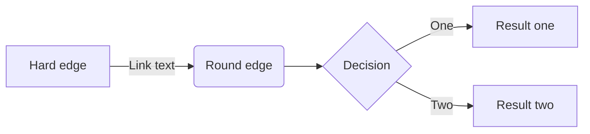

<!--more-->

I was shy, so I hid.

## Ruby

[Hugo]^(An open-source static site generator)

## Math

$$ \ce{CO2 + C -> 2 CO} $$

$$ \ce{Hg^2+ ->[I-] HgI2 ->[I-] [Hg^{II}I4]^2-} $$

## style

{{< style "text-align:right; strong{color:#00b1ff;}" >}}
This is a **right-aligned** paragraph.


## Script


console.log('before decrypting');

document.addEventListener('DOMContentLoaded', () => {
  fixit.decryptor.addEventListener('decrypted', function() {
    console.log('after decrypting')
  })
});


## Mermaid



## Echarts

```echarts
title:
    text: Summary Line Chart
    top: 2%
    left: center
tooltip:
    trigger: axis
legend:
    data:
        - Email Marketing
        - Affiliate Advertising
        - Video Advertising
        - Direct View
        - Search Engine
    top: 10%
grid:
    left: 5%
    right: 5%
    bottom: 5%
    top: 20%
    containLabel: true
toolbox:
    feature:
        saveAsImage:
            title: Save as Image
xAxis:
    type: category
    boundaryGap: false
    data:
        - Monday
        - Tuesday
        - Wednesday
        - Thursday
        - Friday
        - Saturday
        - Sunday
yAxis:
    type: value
series:
    - name: Email Marketing
      type: line
      stack: Total
      data:
          - 120
          - 132
          - 101
          - 134
          - 90
          - 230
          - 210
    - name: Affiliate Advertising
      type: line
      stack: Total
      data:
          - 220
          - 182
          - 191
          - 234
          - 290
          - 330
          - 310
    - name: Video Advertising
      type: line
      stack: Total
      data:
          - 150
          - 232
          - 201
          - 154
          - 190
          - 330
          - 410
    - name: Direct View
      type: line
      stack: Total
      data:
          - 320
          - 332
          - 301
          - 334
          - 390
          - 330
          - 320
    - name: Search Engine
      type: line
      stack: Total
      data:
          - 820
          - 932
          - 901
          - 934
          - 1290
          - 1330
          - 1320
```

## Typeit


console.log('before decrypting');

document.addEventListener('DOMContentLoaded', () => {
  fixit.decryptor.addEventListener('decrypted', function() {
    console.log('after decrypting')
  })
});


## fixit-encryptor

All the following shortcodes passwords are `1212`.

{}
如果你愿意一层一层一层地剥开我的心
{}
你会发现 你会讶异
{}
你是我最压抑最深处的秘密
{}
{}
{}
