The FixIt theme supports two ways to use Mermaid: code block syntax and shortcode syntax.

## Flowchart

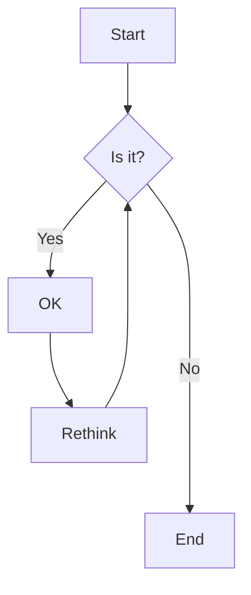

<!--more-->

## Sequence Diagram

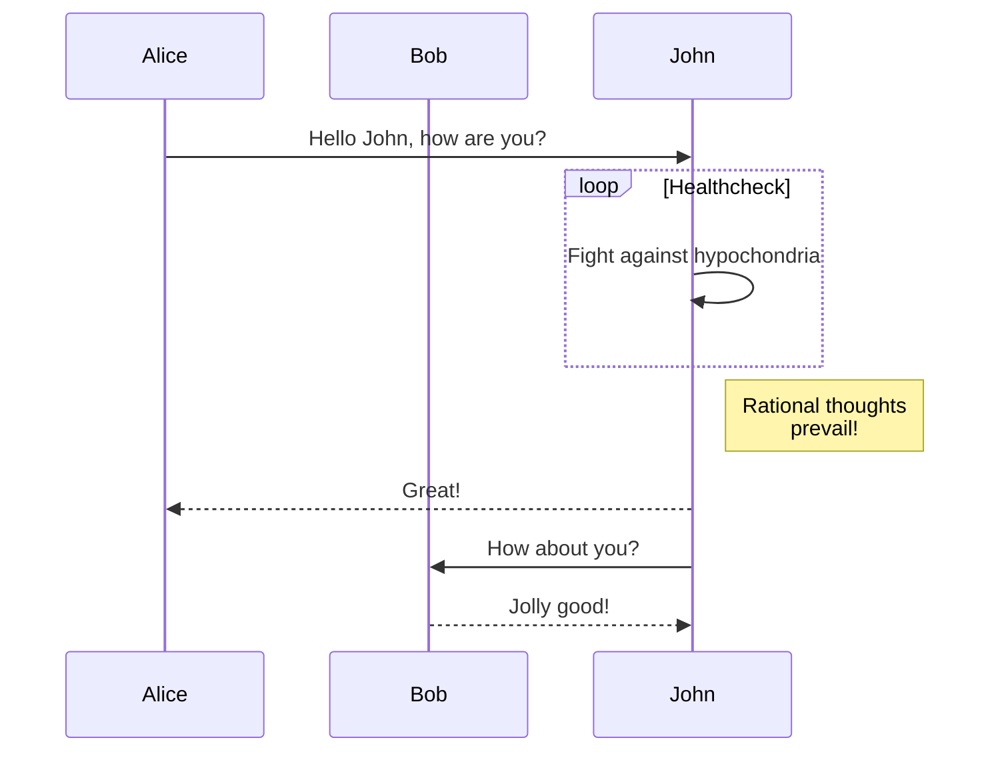

## Gantt Chart


gantt
    title A Gantt Diagram
    dateFormat  YYYY-MM-DD
    section Section
    A task           :a1, 2014-01-01, 30d
    Another task     :after a1  , 20d
    section Another
    Task in sec      :2014-01-12  , 12d
    another task      : 24d


## Class Diagram

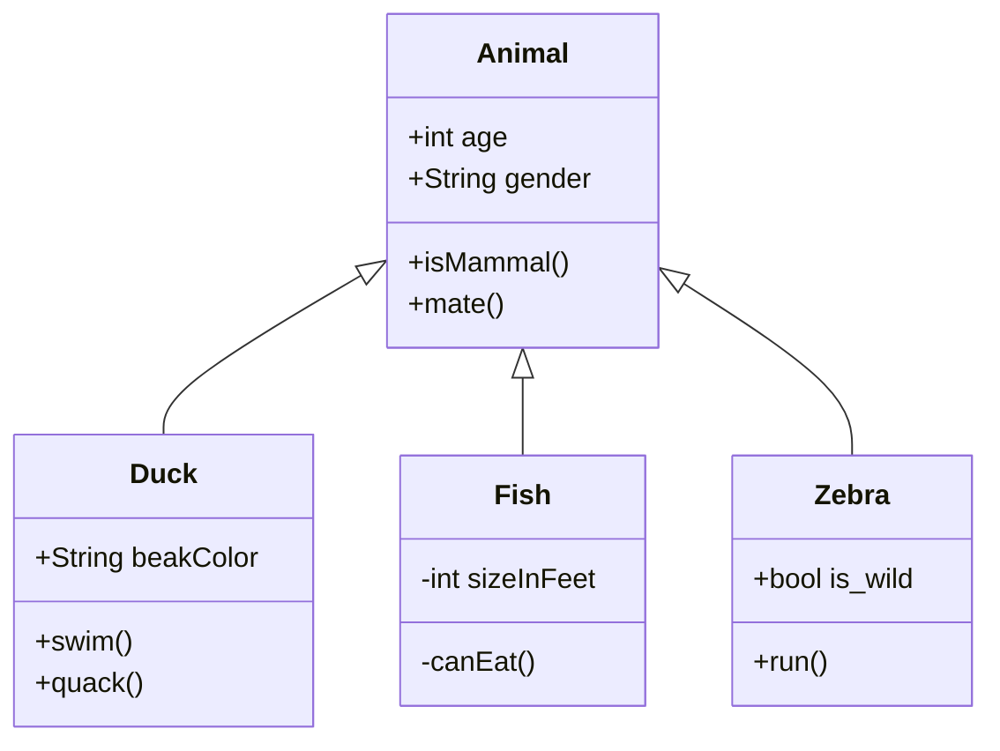

## State Diagram

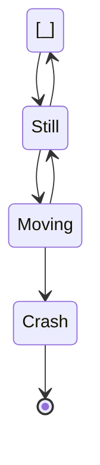

## Entity Relationship Diagram

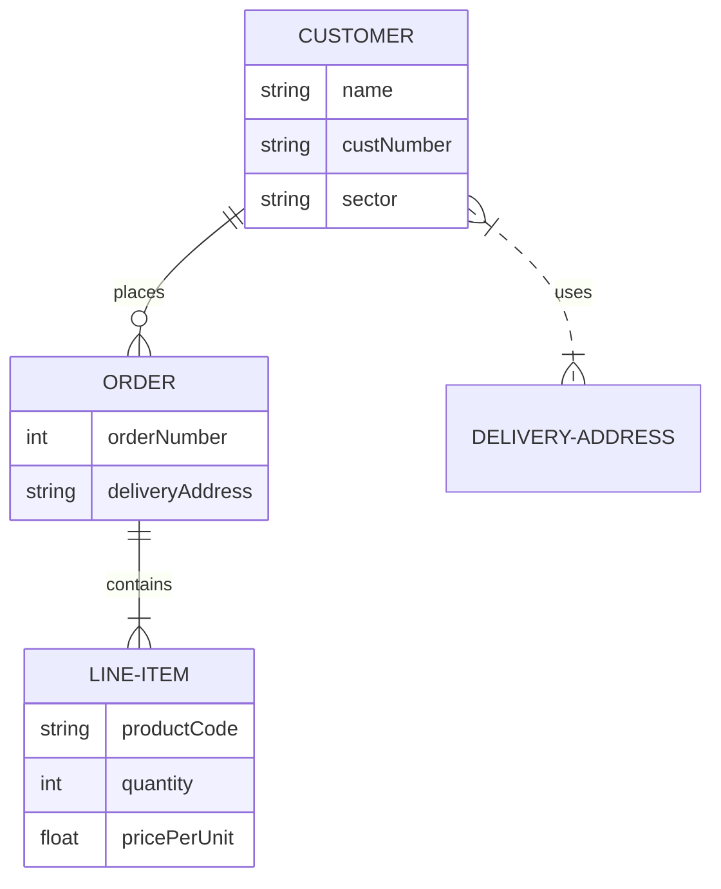

## User Journey


journey
    title My working day
    section Go to work
      Make tea: 5: Me
      Go upstairs: 3: Me
      Do work: 1: Me, Cat
    section Go home
      Go downstairs: 5: Me
      Sit down: 5: Me


## Git Graph

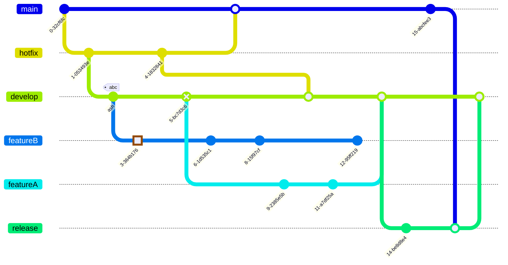

## Pie Chart


pie title What Voldemort doesn't have?
    "FRIENDS" : 2
    "FAMILY" : 3
    "NOSE" : 45


## Quadrant Chart

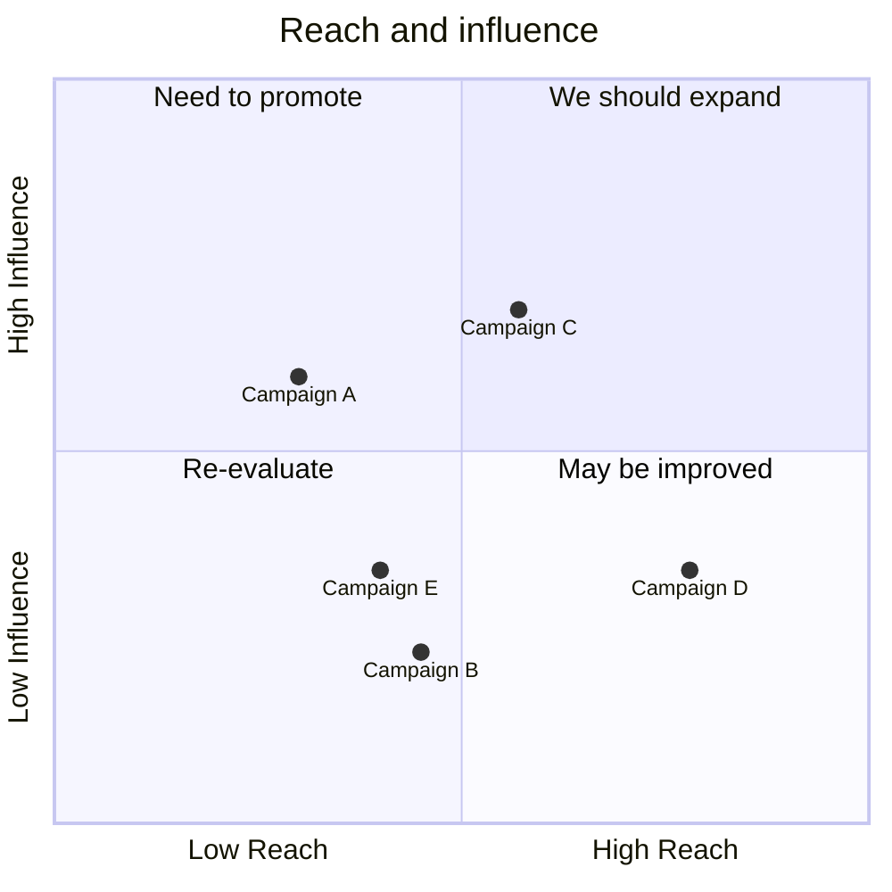

## Timeline

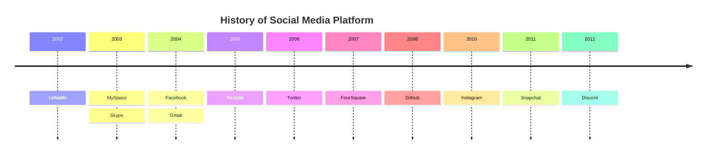

## Mindmap

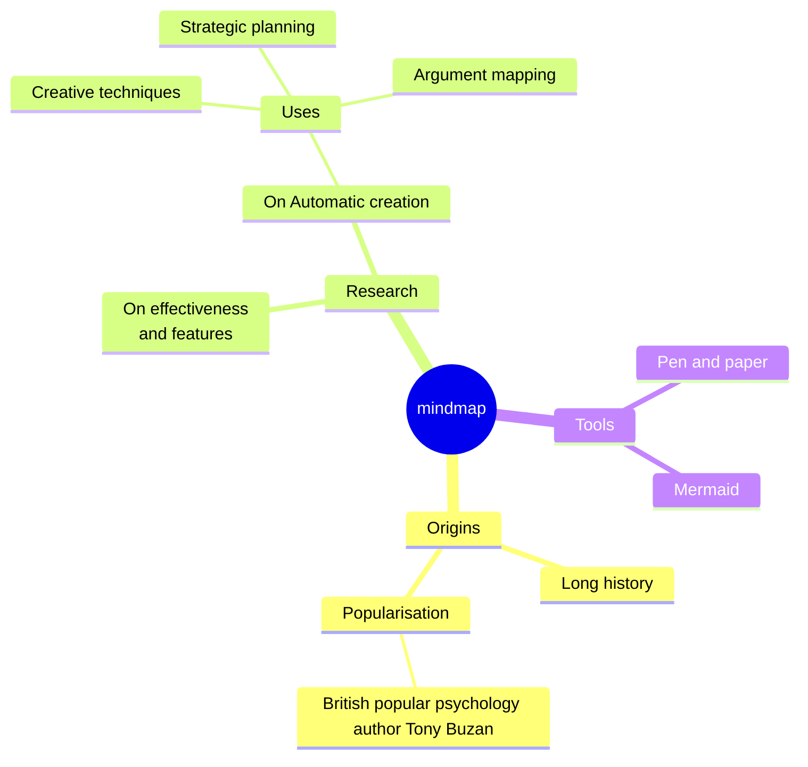

## XY Chart


xychart-beta
    title "Sales Revenue"
    x-axis [jan, feb, mar, apr, may, jun, jul, aug, sep, oct, nov, dec]
    y-axis "Revenue (in $)" 4000 --> 11000
    bar [5000, 6000, 7500, 8200, 9500, 10500, 11000, 10200, 9200, 8500, 7000, 6000]
    line [5000, 6000, 7500, 8200, 9500, 10500, 11000, 10200, 9200, 8500, 7000, 6000]


## Requirement Diagram

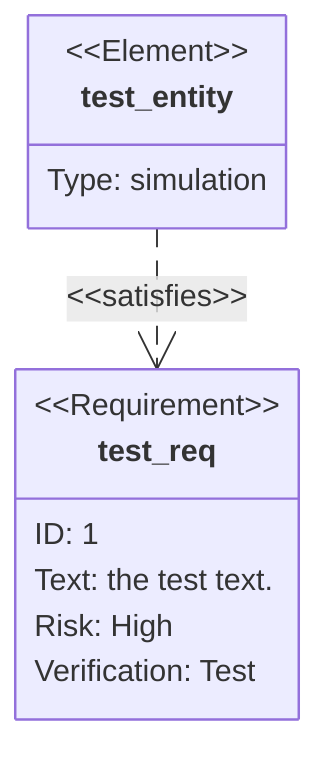

## C4 Architecture

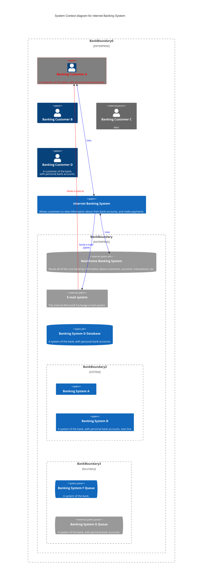

## ZenUML


zenuml
    title Demo
    Alice->John: Hello John, how are you?
    John->Alice: Great!
    Alice->John: See you later!


## Sankey Diagram

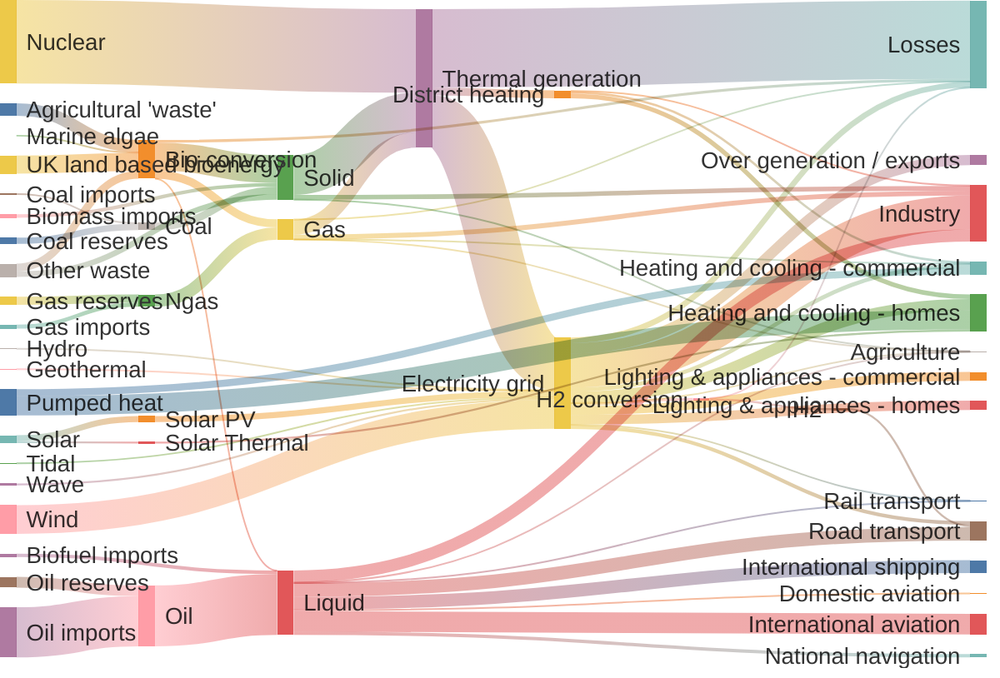

## Block Diagram


block-beta
columns 1
  db(("DB"))
  blockArrowId6<["&nbsp;&nbsp;&nbsp;"]>(down)
  block:ID
    A
    B["A wide one in the middle"]
    C
  end
  space
  D
  ID --> D
  C --> D
  style B fill:#969,stroke:#333,stroke-width:4px


## Packet Diagram

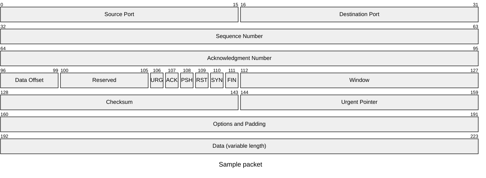

## Kanban

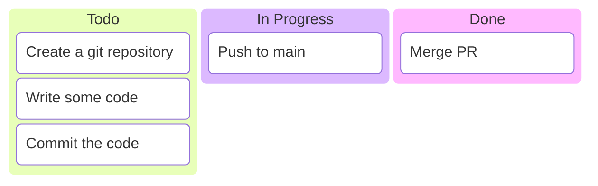

## Architecture Diagram

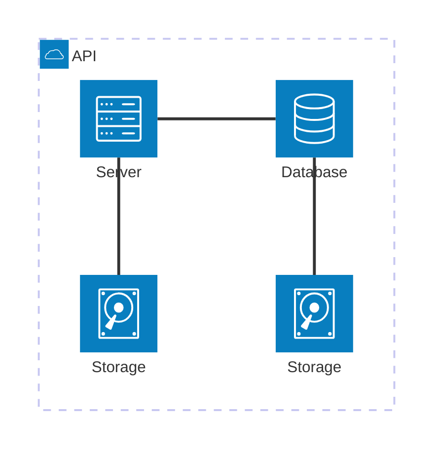

## Radar Chart

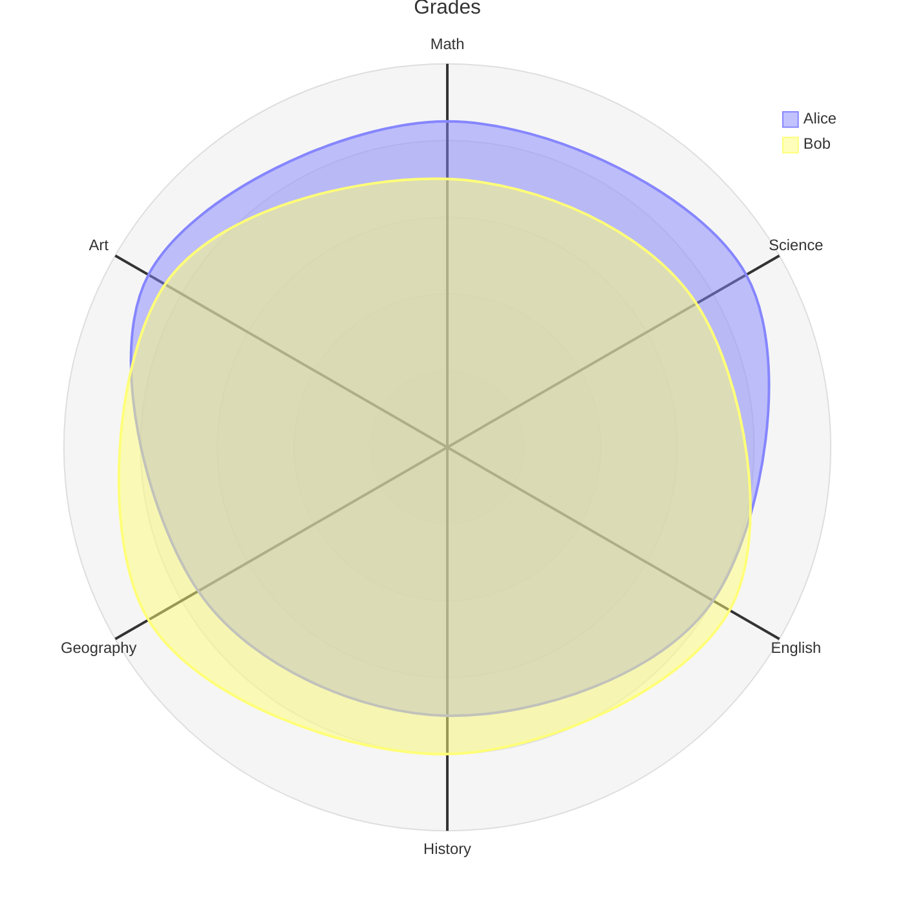

## Treemap

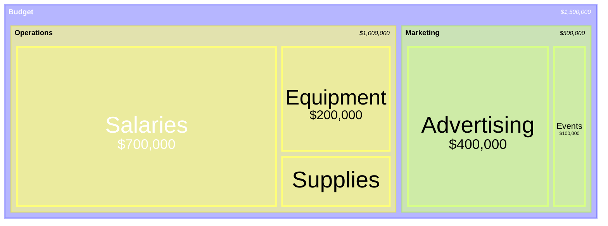

---

The above test cases cover the main Mermaid diagram types, including:

**Core Diagrams:**

- Flowcharts, Sequence Diagrams, Gantt Charts
- Class Diagrams, State Diagrams, Entity Relationship Diagrams
- User Journey, Git Graph, Pie Charts

**Advanced Diagrams:**

- Quadrant Charts, Timeline, Mindmaps
- XY Charts, Requirement Diagrams, C4 Architecture
- ZenUML, Sankey, Block Diagrams

**Experimental Diagrams (🔥):**

- Packet, Kanban, Architecture
- Radar Charts, Treemap

Each diagram type provides examples using both code block and shortcode syntax.
