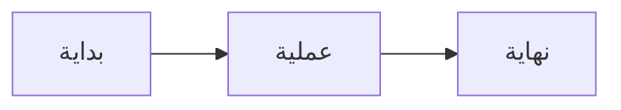

هذا مقال اختباري شامل لدعم اللغة العربية والكتابة من اليمين إلى اليسار في سمة [FixIt](https://github.com/hugo-fixit/FixIt/). يهدف هذا المقال إلى اختبار جميع عناصر الويب المختلفة مع المحتوى العربي.

<!--more-->

## المقدمة

مرحباً بكم في هذا المقال الاختباري الشامل. اللغة العربية هي واحدة من أكثر اللغات انتشاراً في العالم، وتتميز بكتابتها من اليمين إلى اليسار. يتطلب دعم هذه اللغة في تصميمات الويب اهتماماً خاصاً بالعديد من الجوانب التقنية.

### لماذا RTL مهم؟

عندما نصمم مواقع ويب تدعم اللغات التي تُكتب من اليمين إلى اليسار، يجب علينا مراعاة عدة عوامل:

- **اتجاه النص**: يجب أن يتدفق النص بشكل طبيعي من اليمين إلى اليسار
- **تخطيط الصفحة**: يجب أن تكون العناصر مرتبة بشكل منطقي
- **الرموز والأيقونات**: قد تحتاج بعضها إلى انعكاس
- **التباعد بين الأسطر**: يحتاج النص العربي إلى مساحة أكبر للتشكيل

## النص المختلط

هذا نص يحتوي على كلمات إنجليزية مثل JavaScript و HTML و CSS مع نص عربي. يجب أن يظهر كل شيء بشكل صحيح.

## الروابط

- [موقع Hugo](https://gohugo.io)
- [سمة FixIt](https://fixit.lruihao.cn)
- [وثائق RTL](https://rtlstyling.com)

## القوائم

القوائم غير المرتبة:

- عنصر القائمة الأول
- عنصر القائمة الثاني
- عنصر القائمة الثالث
  - عنصر فرعي
  - عنصر فرعي آخر

القوائم المرتبة:

1. الخطوة الأولى في العملية
2. الخطوة الثانية
3. الخطوة الثالثة والأخيرة

قوائم المهام:

- [x] إعداد بيئة التطوير
- [x] كتابة المحتوى الأساسي
- [ ] اختبار التوافق مع المتصفحات
- [ ] مراجعة التصميم النهائي
- [ ] نشر الموقع

## الجداول

| اللغة      | الاتجاه | الحروف المتصلة |
| ---------: | ------: | -------------: |
| العربية    | RTL     | نعم            |
| الفارسية   | RTL     | نعم            |
| العبرية    | RTL     | لا             |
| الإنجليزية | LTR     | لا             |

## الاقتباسات

> العلم نور والجهل ظلام
> — مثل عربي

اقتباس طويل:

> إن الله لا يغير ما بقوم حتى يغيروا ما بأنفسهم وإذا أراد الله بقوم سوءاً فلا مرد له وما لهم من دونه من وال

## الأيقونات

أيقونات يتم قلبها في RTL:

- :(fa-solid fa-tag): وسم
- :(fa-solid fa-tags): وسوم
- :(fa-solid fa-folder): مجلد
- :(fa-solid fa-folder-open): مجلد مفتوح
- :(fa-solid fa-pen-to-square): قلم تعديل

أيقونات لا يتم قلبها في RTL:

- :(fa-solid fa-share): مشاركة
- :(fa-solid fa-search): بحث

## التبويبات


{}
محتوى التبويب الأول.
{}
{}
محتوى التبويب الثاني.
{}


## التفاصيل القابلة للطي

<details>
<summary>انقر لعرض التفاصيل</summary>

هذا محتوى مخفي يمكنBOOLE توسيعه بالنقر.

المحتوى يمكن أن يكون نصاً أو كوداً أو أي عنصر آخر.

</details>

## التنبيهات


هذا تنبيه عادي يحتوي على معلومات مفيدة للمستخدم.


> [!IMPORTANT]
> تأكد من اختبار جميع التغييرات قبل النشر.

## المحتوى المشفر


هذا محتوى مشفر. يجب إدخال كلمة المرور لعرضه.


## أمثلة على المحتوى LTR

في صفحة RTL، بعض العناصر تبقى باتجاه LTR لأن محتاها لغوي بحت أو برمجي. فيما يلي أمثلة:

### كتلة الكود

```c
#include <stdio.h>

int main() {
    printf("Hello, World!\n");
    return 0;
}
```

### عارض JSON

```json
{
  "name": "FixIt",
  "version": "1.0.0",
  "features": ["RTL", "i18n", "shortcodes"]
}
```

### تبويبات الكود

```python {group=tab1}
print("Python")
```

```go {group=tab1}
fmt.Println("Go")
```

### الصيغ الرياضية

معادلة بسيطة: $E = mc^2$

معادلة معقدة:

$$\sum_{i=1}^{n} i = \frac{n(n+1)}{2}$$

### مخططات Mermaid



---
{.awesome-hr}

_تم إنشاء هذا المقال لاختبار دعم اللغة العربية في سمة FixIt._
