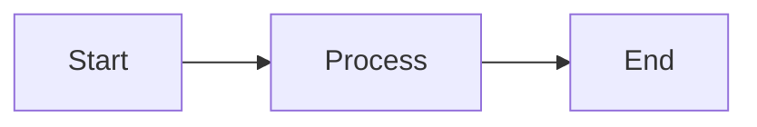

A comprehensive test article for Arabic language and Right-to-Left layout support in the [FixIt](https://github.com/hugo-fixit/FixIt/) theme. This article tests various web elements with Arabic content.

<!--more-->

## Introduction

Welcome to this comprehensive test article. Arabic is one of the most widely spoken languages in the world, characterized by its Right-to-Left writing direction. Supporting this language in web designs requires special attention to many technical aspects.

### Why RTL Matters

When designing websites that support Right-to-Left languages, we need to consider several factors:

- **Text direction**: Text should flow naturally from right to left
- **Page layout**: Elements should be arranged in a logical order
- **Symbols and icons**: Some may need to be mirrored
- **Line spacing**: Arabic text needs more space for diacritics

## Mixed Text

This text contains English words like JavaScript, HTML, and CSS alongside Arabic text. Everything should display correctly.

## Links

- [Hugo Website](https://gohugo.io)
- [FixIt Theme](https://fixit.lruihao.cn)
- [RTL Styling](https://rtlstyling.com)

## Lists

Unordered lists:

- First list item
- Second list item
- Third list item
  - Sub item
  - Another sub item

Ordered lists:

1. First step in the process
2. Second step
3. Third and final step

Task lists:

- [x] Set up development environment
- [x] Write basic content
- [ ] Test browser compatibility
- [ ] Review final design
- [ ] Deploy website

## Tables

| Language   | Direction | Connected Letters |
| ---------- | --------- | ----------------- |
| Arabic     | RTL       | Yes               |
| Persian    | RTL       | Yes               |
| Hebrew     | RTL       | No                |
| English    | LTR       | No                |

## Blockquotes

> Knowledge is light and ignorance is darkness
> — Arabic proverb

Long quote:

> Indeed, Allah does not change the condition of a people until they change what is in themselves

## Icons

Icons that are flipped in RTL:

- :(fa-solid fa-tag): Tag
- :(fa-solid fa-tags): Tags
- :(fa-solid fa-folder): Folder
- :(fa-solid fa-folder-open): Folder Open
- :(fa-solid fa-pen-to-square): Edit

Icons that are NOT flipped in RTL:

- :(fa-solid fa-share): Share
- :(fa-solid fa-search): Search

## Tabs


{}
Content of the first tab.
{}
{}
Content of the second tab.
{}


## Collapsible Details

<details>
<summary>Click to show details</summary>

This is hidden content that can be expanded by clicking.

Content can be text, code, or any other element.

</details>

## Alerts


This is a regular admonition with useful information for the user.


> [!IMPORTANT]
> Make sure to test all changes before deploying.

## Encrypted Content


This is encrypted content. You must enter the password to view it.


## LTR Content Examples

In an RTL page, some elements remain in LTR direction because their content is purely linguistic or programmatic. Here are examples:

### Code Block

```c
#include <stdio.h>

int main() {
    printf("Hello, World!\n");
    return 0;
}
```

### JSON Viewer

```json
{
  "name": "FixIt",
  "version": "1.0.0",
  "features": ["RTL", "i18n", "shortcodes"]
}
```

### Code Tabs

```python {group=tab1}
print("Python")
```

```go {group=tab1}
fmt.Println("Go")
```

### Math

Simple equation: $E = mc^2$

Complex equation:

$$\sum_{i=1}^{n} i = \frac{n(n+1)}{2}$$

### Mermaid Diagram



---

_Created to test Arabic language support in the FixIt theme._
