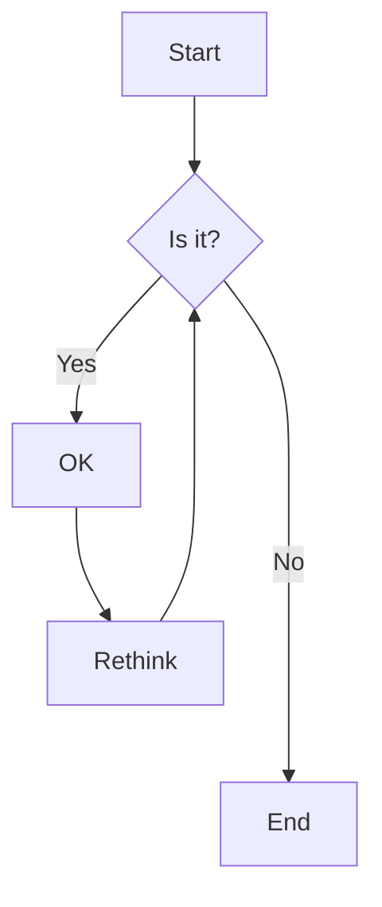
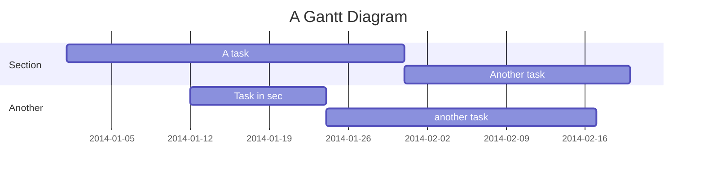

Testing various configurations and nested scenarios for the Tabs shortcode.


{}See Types section for various test cases.{}
{}See Nested Tabs section for examples.{}


<!--more-->

## Types

### Underline (Default)

<!-- placement: top, bottom, left, right -->


{}Content for underline style tab 1{}
{}Content for underline style tab 2{}
{}Content for underline style tab 3{}


### Pill

<!-- placement: top, bottom, left, right -->


{}Content for pill style tab 1{}
{}Content for pill style tab 2{}
{}Content for pill style tab 3{}


### Card

<!-- placement: top, bottom, left, right -->


{}Content for card style tab 1{}
{}Content for card style tab 2{}
{}Content for card style tab 3{}


### Segment


{}Content for segment style tab 1{}
{}Content for segment style tab 2{}
{}Content for segment style tab 3{}


## Nested Tabs



{}
This is the first outer tab with simple content.

**Features:**

- Basic text content
- No nested components
- Simple layout
{}

{}
This outer tab contains nested tabs inside:



{}
Nested tab A content with **bold text** and _italic text_.

```javascript
console.log('Hello from nested tab A!')
```

{}

{}
Nested tab B content with a list:

1. First item
2. Second item
3. Third item

> This is a blockquote inside a nested tab.
{}

{}
Nested tab C with a table:

| Feature    | Status | Notes                  |
| :--------- | :----- | :--------------------- |
| Responsive | ✅     | Works on all devices   |
| Accessible | ✅     | Screen reader friendly |
| Fast       | ✅     | Optimized performance  |

{}



{}

{}
This tab contains vertical nested tabs:



{}
Content for vertical nested tab A.

- Feature 1
- Feature 2
- Feature 3
{}

{}
Content for vertical nested tab B.

```css
.example {
  color: #333;
  background: #f5f5f5;
  padding: 1rem;
}
```

{}



{}



## Others

### Mermaid Diagram inside Tabs


{}



{}
{}



{}

